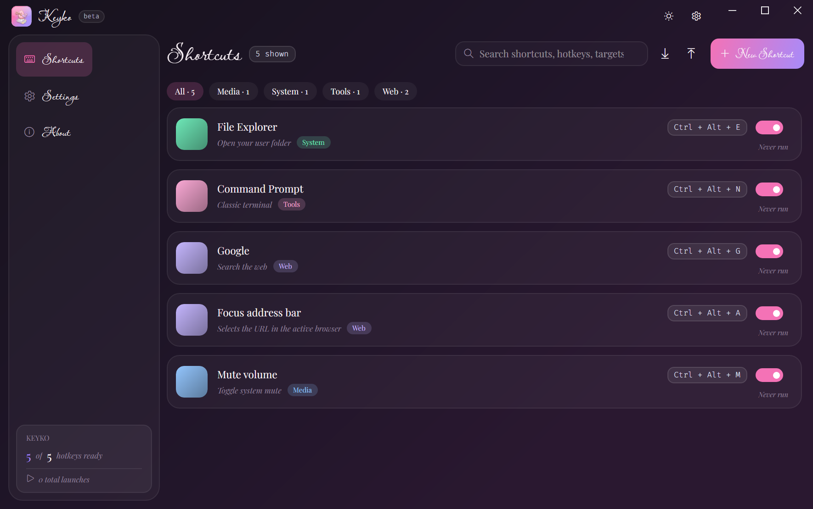
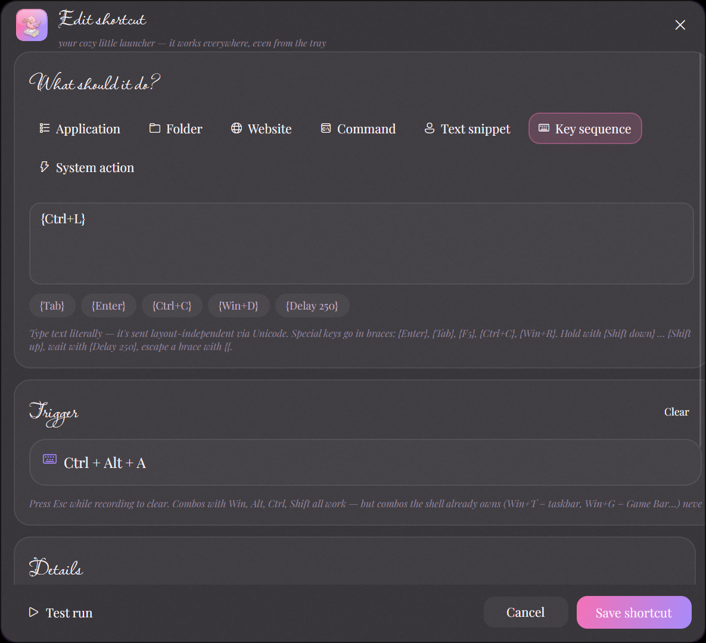
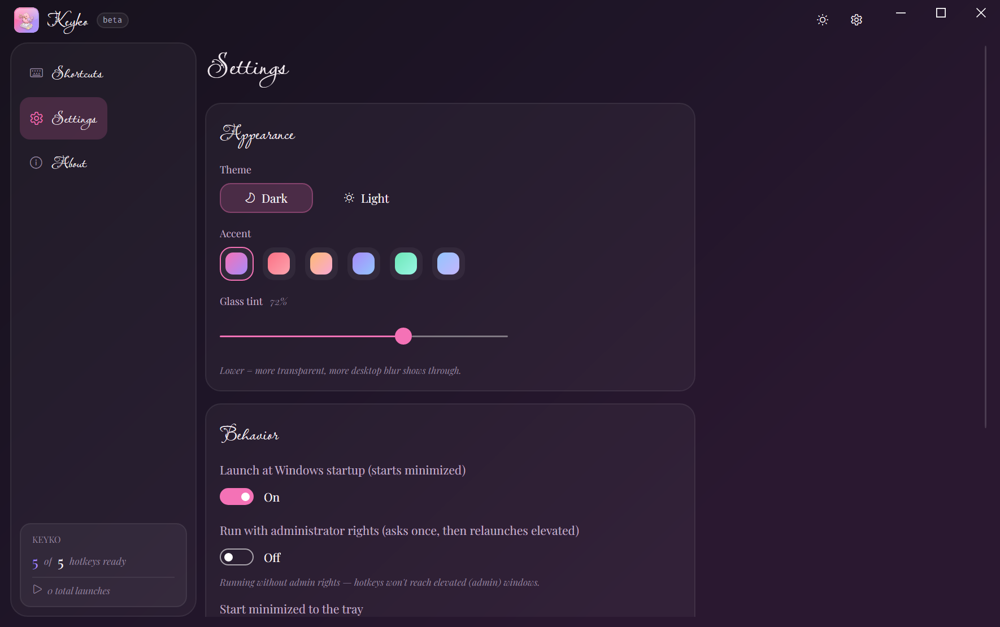
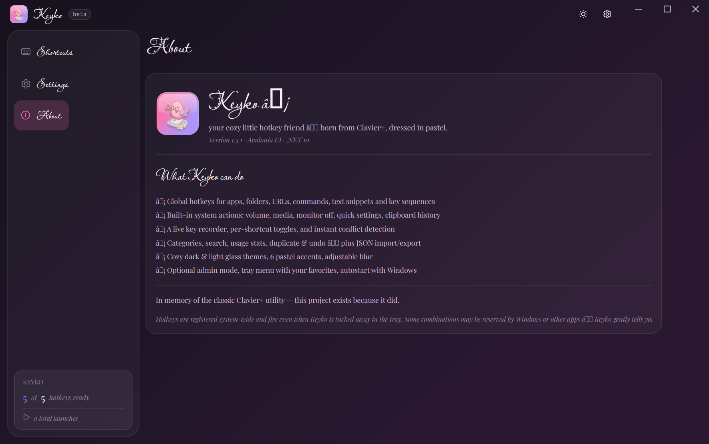
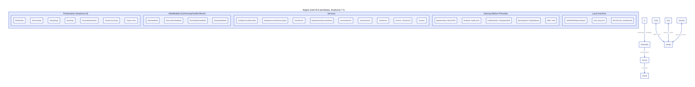
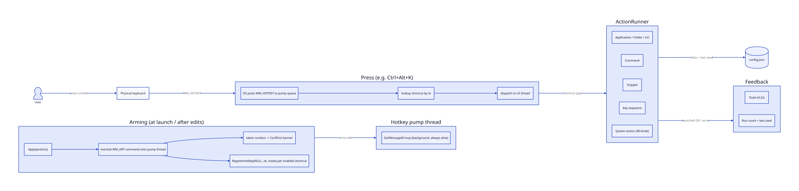
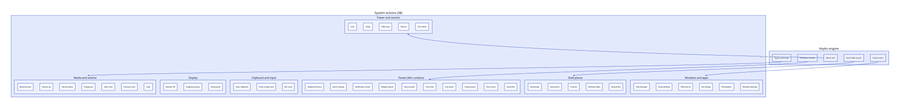
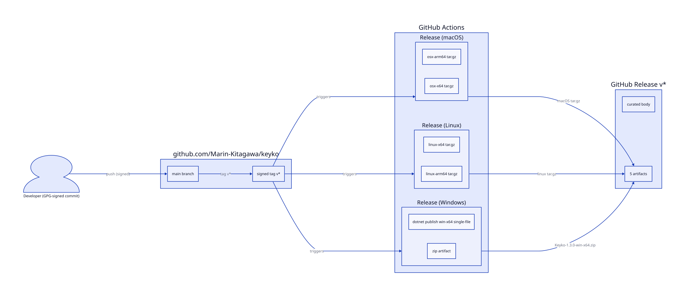

  

= Keyko ♡

A cozy, pastel, *global hotkey launcher* for Windows — press a key combination anywhere and make something happen: launch an app, open a folder, paste a snippet, run a key sequence, mute your mic, lock your PC…

Keyko is a modern spiritual successor to the classic Clavier+ utility, rebuilt from scratch on Avalonia 11 and .NET 10 with an acrylic-glass UI, script typography and a hand-lettered pastel look.

ifndef::env-github[]
// GitHub renders AsciiDoc images fine; the attributes below only tune local AsciiDoctor output.
endif::[]

== ♡ Why Keyko

Clavier+ proved that a launcher living entirely in the tray is one of the best quality-of-life tools Windows never shipped. Keyko keeps that idea and brings it into the present:

* *Glassy modern UI* — acrylic desktop blur, warm plum darkness, Lavishly Yours script headings, Playfair Display body text with true italics, Fira Code keycaps, six pastel accent themes (Blossom, Rose, Peach, Lavender, Mint, Sky)
* *38 built-in system actions* — media, volume, power, panels, shell places, clipboard, mic mute… no external tools needed
* *Key sequences* — Clavier+-style macro syntax (`{Ctrl+C}`, `{Win+R}`, `{Delay 250}`) backed by layout-independent Unicode input
* *Real feedback* — non-focus-stealing toasts, an armed-hotkeys counter, per-shortcut usage stats and a conflict banner that names the app that stole your combo
* *Safe by construction* — GPG-signed releases, per-user installation, no admin required (optional elevated mode exists)

== ♡ Features

=== Shortcuts

[cols="1,3"]
|===
|Type |What it does

|Application
|Launch a program with arguments and a working directory

|Folder
|Open a folder in File Explorer

|Website
|Open a URL in your default browser

|Command
|Run a shell command hidden via `cmd /c`

|Text snippet
|Copy text to the clipboard and paste it at the cursor, in any app

|Key sequence
|Send a full macro: literal text plus `{Enter}`, `{Ctrl+C}`, `{Win+R}`, `{Delay 250}`… in Clavier+ syntax

|System action
|38 built-in Windows actions (see <<system-actions, the table below>>)
|===

Every shortcut gets:

* a *live key recorder* — click, press the combo, done (modifiers, F-keys, numpad, media keys)
* *conflict detection* — Keyko warns when a combo is taken by another shortcut or another app, and names the app
* an *enable toggle* — keep a shortcut configured but disarmed
* *usage stats* — launch counter and last-used time
* a *category chip* for filtering, plus duplicate and delete-with-undo

=== System actions

[[system-actions]]
The built-in actions map directly onto Windows APIs — no child processes, no scripts:

[cols="1,1"]
|===
|Group |Actions

|Media & volume
|Mute/unmute · volume up/down · play/pause · next/previous/stop track

|Panels
|Clipboard history · quick settings · notification center · widgets · search · Task View · cast · project · Start menu · Game Bar

|Display
|Monitor off · snipping overlay · emoji panel

|Power & session
|Lock · sleep · hibernate · restart · shut down

|Windows & apps
|Task Manager · show desktop · minimize all · Run dialog · File Explorer · Windows Settings

|Shell places
|Downloads · Documents · Pictures · Desktop · Recycle Bin

|Clipboard & input
|Clear clipboard · paste as plain text (Win+Ctrl+V) · microphone mute (Win+Alt+K)
|===

Shell-owned combos that Windows itself intercepts (Win+T, Win+G, Win+L…) can't be claimed by any launcher — Keyko detects this and tells you instead of failing silently.

=== Trust & elevation

* Optional *run as administrator*: one click relaunches elevated (UAC asks once); with launch-on-startup Keyko registers a scheduled task with highest privileges so logon starts elevated without a prompt
* Autostart normally uses the classic HKCU Run key — the scheduled task is only created when admin mode is on
* Single-instance guard with a graceful handover during relaunch

== ♡ Screenshots

.The shortcut editor with the live key recorder

.Settings — theme, pastel accents, glass tint, behavior

.About page

== ♡ How it works

Keyko is a compact Avalonia MVVM application. The hotkey engine arms thread-level hotkeys on a dedicated pump thread (registration is thread-affine, so arming commands are marshalled onto that thread), and every launch flows through a single runner.

.Architecture — layers and responsibilities

.The life of a hotkey, from keypress to toast

What each of the 38 system actions maps onto:

.System action mechanisms

== ♡ Building

You need the .NET SDK (10 or a recent 8/9 — retarget `net10.0-windows` if needed):

[source,bash]
----
git clone https://github.com/Marin-Kitagawa/keyko.git
cd keyko
dotnet build src/Keyko -c Release
dotnet run --project src/Keyko -c Release
----

A self-contained single-file executable:

[source,bash]
----
dotnet publish src/Keyko -c Release -r win-x64 --self-contained true \
  -p:PublishSingleFile=true \
  -p:IncludeNativeLibrariesForSelfExtract=true \
  -p:EnableCompressionInSingleFile=true \
  -o dist
----

Regenerating the application icons from a source PNG, rendering the D2 diagrams in this README, and running the visual self-test:

[source,bash]
----
dotnet run --project tools/IconGen -- src/Keyko/Assets --from path\\to\\logo.png
path\\to\\d2 diagrams\\architecture.d2 diagrams\\architecture.svg
dotnet run --project tools/FontSampler -- path\\to\\fonts out.png
Keyko.exe --selftest out1.png out2.png out3.png out4.png
----

`--selftest` renders UI screenshots without activating a window or synthesizing input (safe while you're gaming); add `--keep-open` to keep the app alive for live window captures.

== ♡ Configuration

Everything lives in one human-readable JSON file (override the location with the `KEYKO_CONFIG_DIR` environment variable):

----
%APPDATA%\\Keyko\\config.json
----

Shortcuts, theme, accent, glass tint and usage stats are all in there — and the *Export / Import* buttons on the Shortcuts page move the whole profile between machines.

== ♡ Release pipeline

Pushing a signed `v*` tag builds Windows, Linux and macOS artifacts on GitHub Actions and publishes them as a release with notes taken from the tag annotation.

.From tag to five installers

NOTE: Linux and macOS builds are experimental — the hotkey engine is Windows-only today, so those builds run with the UI, snippets and theming but without global hotkeys. macOS binaries are unsigned (right-click → Open on first launch).

== ♡ Credits

Keyko's shape is a love letter to the classic *Clavier+* utility — the original proof that a tray-resident hotkey launcher is all the desktop helper you need.

* Built with link:https://avaloniaui.net[Avalonia UI], .NET 10, CommunityToolkit.Mvvm and Fira Code
* Fonts: Lavishly Yours, Playfair Display, Fira Code (all SIL Open Font License)
* Icons: Segoe Fluent Icons

made with ♡ and pastel glass
