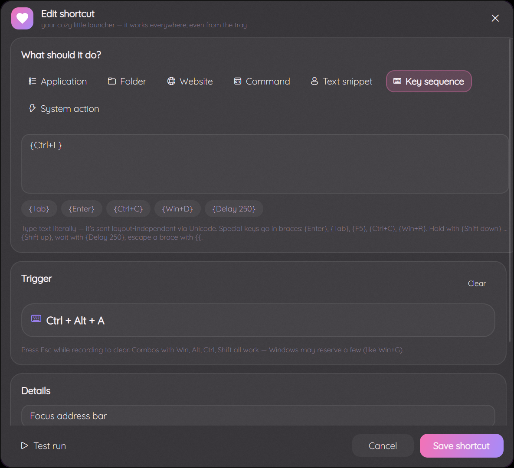
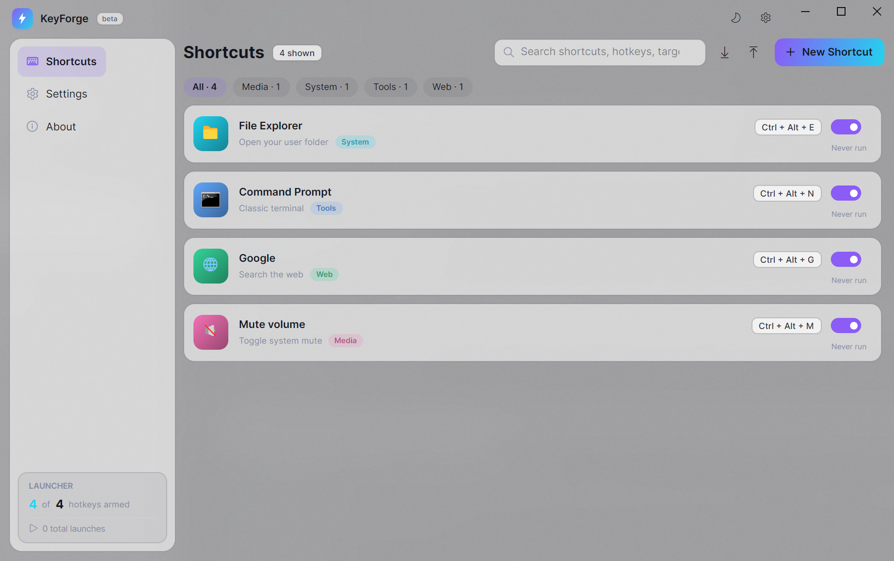

# Keyko ♡

**Keyko** (key + the name Keiko) is a cozy, pastel, glassy global-hotkey launcher for Windows — a
spiritual successor to [Clavier+](https://github.com/guilryder/clavier-plus) (last updated ~3 years ago),
rebuilt on **Avalonia UI 11 + .NET 10** with soft acrylic glass, rounded corners, and a bunch of features
Clavier+ never had.


## Features

**Core (Clavier+ parity, modernized)**

- Global hotkeys that work system-wide, even when the app is minimized to the tray
- Launch **applications** (with arguments + working directory), open **folders**, open **websites**
- Live **key recorder** — click, press the combo, done (Esc clears)
- Runs quietly in the system tray with a quick-launch menu of your top shortcuts
- Single instance, launch at Windows startup, start minimized

**What's new over Clavier+**

- More action types: shell **commands** (hidden `cmd /c`), **text snippets** (clipboard + auto-paste),
  **key sequences** (Clavier+-style macro syntax on SendInput — see below), and built-in
  **system actions** — volume, media keys, monitor off, Task Manager, clipboard history (Win+V), quick settings, notification center
- **Key sequences**: type literal text (layout-independent Unicode) plus `{Enter}`, `{Tab}`, `{F5}`,
  combos like `{Ctrl+C}` / `{Win+R}`, held keys with `{Shift down} … {Shift up}`, pauses with `{Delay 250}`,
  `{{` for a literal brace. Quick-insert chips in the editor.
- **Run as administrator**: one toggle relaunches Keyko elevated (UAC asks once); with "launch at startup"
  it registers a **scheduled task with highest privileges** so logon starts elevated *without* a UAC prompt —
  hotkeys then reach admin windows. An "admin" badge in the titlebar and a tray item show the state.
- **Instant conflict detection** — warns in the editor when a combo is already used by another shortcut *or* another app
  (failed registrations are reported, since Windows refuses duplicates)
- **Categories** with colored chips + instant search across names, hotkeys, targets
- Per-shortcut **enable/disable** toggles, **duplicate**, **delete with undo**, double-click to edit
- **Usage stats**: launch counters, "last used", totals in the sidebar
- **JSON profiles**: export/import your setup, portable between machines
 - **Cozy looks**: acrylic glass, dark & light themes, 6 pastel accents (Blossom, Rose, Peach, Lavender, Mint, Sky),
  adjustable blur, rounded everything, Lavishly Yours script headings, Playfair Display regular/italic body, Fira Code keycaps, clean Fluent icons (no icon tiles), logo art — the little pink keybird on a keycap ♡ — pastel icon tiles
- Non-focus-stealing **toast notifications** when a hotkey fires (and for errors/undo)

| Editor | Light theme |
| --- | --- |
|  |  |

## Build & run

Requires the .NET SDK (10 or 8 — retarget `net10.0-windows` if needed):

```bash
dotnet build src/Keyko -c Release
dotnet run --project src/Keyko -c Release
```

Publish a single portable exe:

```bash
dotnet publish src/Keyko -c Release -r win-x64 --self-contained true \
  -p:PublishSingleFile=true -o dist
```

First run seeds a few example shortcuts and stores everything in
`%APPDATA%\Keyko\config.json` (override the location with the `KEYKO_CONFIG_DIR` env var).

## Self-test / screenshots

`Keyko.exe --selftest out1.png out2.png out3.png [--keep-open]` renders the UI into PNGs **without ever
activating a window or synthesizing input** (safe to run while you're doing something else). `tools/capture-window.ps1`
grabs a live window via `PrintWindow` for pixel-accurate captures.

## Project layout

```
src/Keyko/
  Models/        ShortcutAction, AppSettings, HotkeyGesture, system-action catalog
  Services/      config (JSON), Win32 hotkey engine, action runner, icon cache,
                 autostart (registry), toasts, theme/glass engine
  ViewModels/    MVVM (CommunityToolkit.Mvvm, compiled bindings)
  Views/         main window, shortcuts/settings/about pages, glass editor dialog
  Themes/        Glass.axaml — the whole Fluent restyle
  Interop/       hand-rolled Win32 (RegisterHotKey message window, SendInput, DWM)
tools/IconGen/   generates app.ico / tray.png with SkiaSharp (bolt on gradient tile)
```

## Notes & limits

- Windows 10/11; acrylic needs DWM (always on there). Some combos are reserved by Windows (e.g. Win+G) —
  Keyko tells you when a registration fails.
- Text snippets work by setting the clipboard and pressing Ctrl+V into whatever has focus.
- Windows-key combos can be recorded, but Windows intercepts a few of them.
- Key sequences: literal text is sent as Unicode input (works for any layout/character); combos inside braces use
  real virtual keys, so they trigger shortcuts, not just text. `{Delay}` accepts up to 10000 ms.

Inspired by Guilherme Ryder's Clavier+ — this project started as "what would that look like in 2026?"
